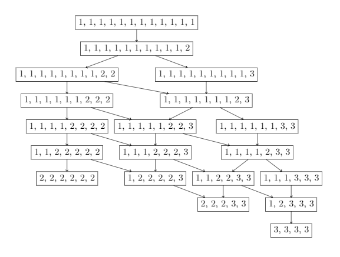

cat-climbing-stairs
===================

A pedantic, tree-based approach to a classic combinatorics problem.

Problem setup
-------------

Say you have a cat and some stairs. Let there be N stairs.

The is going to ascend the stairs by executing a sequence of jumps. For each
jump, the cat will ascend an integer number of stairs between 1 and K.

The goal is to count the total number of unique sequences of jumps the cat
could use to ascend exactly all N stairs.

Tree approach
-------------

This problem can be solved with simpler combinatorics, but just for fun, let's
pose it using a tree.

Let each node of the tree represent a unique unordered collection of integers,
each less than or equal to K, that sum to N.

Our goal will be to find all such nodes by expanding a tree.

Let the root node be the collection of N 1's.

Allow nodes to have descendents in the tree created by adding two of the
elements in their collections of integers, as long as the sum of those two
elements does not exceed K.

We can then expand the tree starting from the root node using this descendent
rule to find all nodes that satisfy the desired property.

Once the tree has been fully explored, all that remains is to count the
permutations at each node and sum over all nodes.

Example
-------

Let N = 9 and K = 3. Then

    $ python client.py 9 3
    "1, 1, 1, 1, 1, 1, 1, 1, 1" -> "1, 1, 1, 1, 1, 1, 1, 2";
    "1, 1, 1, 1, 1, 1, 1, 2" -> "1, 1, 1, 1, 1, 2, 2";
    "1, 1, 1, 1, 1, 2, 2" -> "1, 1, 1, 2, 2, 2";
    "1, 1, 1, 2, 2, 2" -> "1, 2, 2, 2, 2";
    "1, 2, 2, 2, 2" -> "2, 2, 2, 3";
    "1, 1, 1, 2, 2, 2" -> "1, 1, 2, 2, 3";
    "1, 1, 2, 2, 3" -> "2, 2, 2, 3";
    "1, 1, 2, 2, 3" -> "1, 2, 3, 3";
    "1, 2, 3, 3" -> "3, 3, 3";
    "1, 1, 1, 1, 1, 2, 2" -> "1, 1, 1, 1, 2, 3";
    "1, 1, 1, 1, 2, 3" -> "1, 1, 2, 2, 3";
    "1, 1, 1, 1, 2, 3" -> "1, 1, 1, 3, 3";
    "1, 1, 1, 3, 3" -> "1, 2, 3, 3";
    "1, 1, 1, 1, 1, 1, 1, 2" -> "1, 1, 1, 1, 1, 1, 3";
    "1, 1, 1, 1, 1, 1, 3" -> "1, 1, 1, 1, 2, 3";
    149

So there are 149 ways the cat can climb 9 stairs up to 3 at a time.

To visualize the tree, we can create the following tex file:

    $ cat tree.tex
    \documentclass{article}
    \usepackage{tikz}
    \usetikzlibrary{graphs,graphdrawing,quotes}
    \usegdlibrary{trees}
    \begin{document}
    \tikz \graph [tree layout, nodes = {rectangle, draw}, circular placement, radius = 2cm] {
        "1, 1, 1, 1, 1, 1, 1, 1, 1, 1, 1, 1" -> "1, 1, 1, 1, 1, 1, 1, 1, 1, 1, 2";
        "1, 1, 1, 1, 1, 1, 1, 1, 1, 1, 2" -> "1, 1, 1, 1, 1, 1, 1, 1, 2, 2";
        "1, 1, 1, 1, 1, 1, 1, 1, 2, 2" -> "1, 1, 1, 1, 1, 1, 2, 2, 2";
        "1, 1, 1, 1, 1, 1, 2, 2, 2" -> "1, 1, 1, 1, 2, 2, 2, 2";
        "1, 1, 1, 1, 2, 2, 2, 2" -> "1, 1, 2, 2, 2, 2, 2";
        "1, 1, 2, 2, 2, 2, 2" -> "2, 2, 2, 2, 2, 2";
        "1, 1, 2, 2, 2, 2, 2" -> "1, 2, 2, 2, 2, 3";
        "1, 2, 2, 2, 2, 3" -> "2, 2, 2, 3, 3";
        "1, 1, 1, 1, 2, 2, 2, 2" -> "1, 1, 1, 2, 2, 2, 3";
        "1, 1, 1, 2, 2, 2, 3" -> "1, 2, 2, 2, 2, 3";
        "1, 1, 1, 2, 2, 2, 3" -> "1, 1, 2, 2, 3, 3";
        "1, 1, 2, 2, 3, 3" -> "2, 2, 2, 3, 3";
        "1, 1, 2, 2, 3, 3" -> "1, 2, 3, 3, 3";
        "1, 2, 3, 3, 3" -> "3, 3, 3, 3";
        "1, 1, 1, 1, 1, 1, 2, 2, 2" -> "1, 1, 1, 1, 1, 2, 2, 3";
        "1, 1, 1, 1, 1, 2, 2, 3" -> "1, 1, 1, 2, 2, 2, 3";
        "1, 1, 1, 1, 1, 2, 2, 3" -> "1, 1, 1, 1, 2, 3, 3";
        "1, 1, 1, 1, 2, 3, 3" -> "1, 1, 2, 2, 3, 3";
        "1, 1, 1, 1, 2, 3, 3" -> "1, 1, 1, 3, 3, 3";
        "1, 1, 1, 3, 3, 3" -> "1, 2, 3, 3, 3";
        "1, 1, 1, 1, 1, 1, 1, 1, 2, 2" -> "1, 1, 1, 1, 1, 1, 1, 2, 3";
        "1, 1, 1, 1, 1, 1, 1, 2, 3" -> "1, 1, 1, 1, 1, 2, 2, 3";
        "1, 1, 1, 1, 1, 1, 1, 2, 3" -> "1, 1, 1, 1, 1, 1, 3, 3";
        "1, 1, 1, 1, 1, 1, 3, 3" -> "1, 1, 1, 1, 2, 3, 3";
        "1, 1, 1, 1, 1, 1, 1, 1, 1, 1, 2" -> "1, 1, 1, 1, 1, 1, 1, 1, 1, 3";
        "1, 1, 1, 1, 1, 1, 1, 1, 1, 3" -> "1, 1, 1, 1, 1, 1, 1, 2, 3";
    };
    \end{document}

which compiles to the following output:

